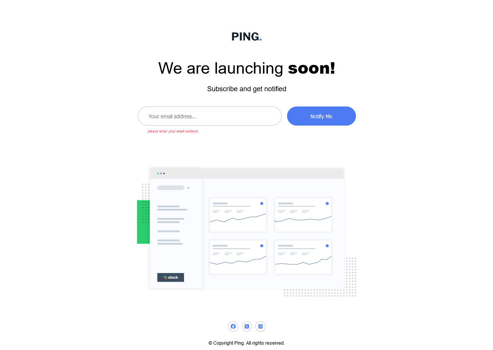
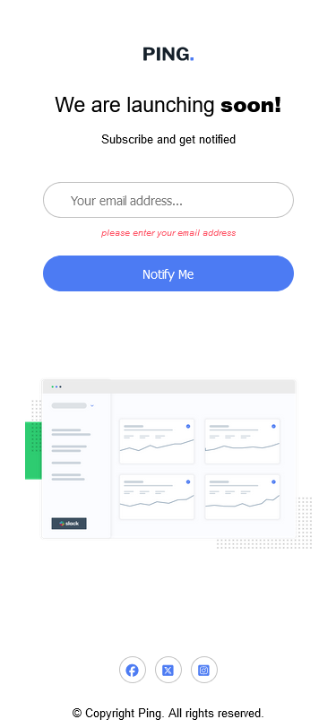

# Frontend Mentor - Ping coming soon page solution

Está é uma solução do [Ping coming soon page challenge on Frontend Mentor](https://www.frontendmentor.io/challenges/ping-single-column-coming-soon-page-5cadd051fec04111f7b848da). Frontend Mentor challenges ajuda a melhorar as habilidades de copdar e ainda faz projetos realistas.

## Table of contents

-   [Visão Geral](#Visão-Geral)
    -   [O desafio](#O-desafio)
    -   [Screenshot](#screenshot)
-   [Meu processo](#Meu-processo)
    -   [O que eu aprendi](#Oque-eu-aprendi)
    -   [Continuar desenvolvendo](#continued-development)
-   [Autor](#Autor)

## Visão Geral

Esse é um projeto que envolve HTML, CSS e JS, esse projeto é provavelmente sobre receber notificações com alguns dashbord, o projeto envolve imagens, logos, um campo para enviar email e um breve titulo

### The challenge

Os usuários devem ser capazes de:

-   Visualizar o layout ideal para o site dependendo do tamanho da tela do dispositivo
-   Ver os estados de hover para todos os elementos interativos da página
-   Enviar seu endereço de e-mail usando um campo `input`
-   Receber uma mensagem de erro quando o `form` for enviado se
    -   O campo `input` estiver vazio. A mensagem para esse erro deve dizer _"Ops! Parece que você esqueceu de adicionar seu e-mail"_
    -   O endereço de e-mail não estiver formatado corretamente (ou seja, um e-mail válido deve ter a estrutura: `nome@dominio.tld`). A mensagem para esse erro deve dizer _"Porfavor, forneça um endereço de e-mail válido"_

### Screenshot






## My process

Foi um processo legal para mim venho a dias fazendo desafios achei o design simples interessante por esse motivo, me deu outra perspectiva, as funções que o site tem é bem simples, aparecer uma mensagem quando o input está vazio e quando o input está sem o @ o CSS e o HTML de desktop para responsivo não tever nada de mais já que seguiu a mesma hierarquia no desgnin nada se moveu pra cima ou para baixo de um elemento para outro, somente a mensagem que aparece que uma é de baixo do input no mobile e oputra que é em baixo do formulario no desktop o js não tive problema por estar me aumentando a carga horaria de codar estou ficando um pouco cansado, mas espero me adapitar a passar mais tempo do dia codando. por isso tive unms errinhos de digitação que me cuistaram uns 15 minutos esquci de fechar um parenteses e coloquei um return no if do email vazio que estava fechando a função antes de terminar o disparo

### O que eu aprendi

primeira vez que me deparo de ter que eliminar um elemento e colocalo em oputro lugar isso que aprendi nesse código. Estou aprendendo a ter mais confiança na minha intuição quando se fala lógica e pensamentar respectivamente de forma a implicar com o processo

```js
if (erroMessage.parentNode) {
    erroMessage.remove();
}
```

### Continuar desenvolvendo

Estou 1 terço feito o curso da #hashtag Javascript Impressionar e pretendo terminar lançar e fazer desafios de frontend e partir para o backend

## Autor

-   Frontend Mentor - [@fredericoGarciasAlves](https://www.frontendmentor.io/profile/FredericoGarciasAlves)
-   intagram - [@fred_alves23](https://www.instagram.com/fred_alves23/)
-   Twitter - [@FredericoGA70](https://x.com/FredericoGA70)
-   Trheads - [@fred_alves23](https://www.threads.net/@fred_alves23)
